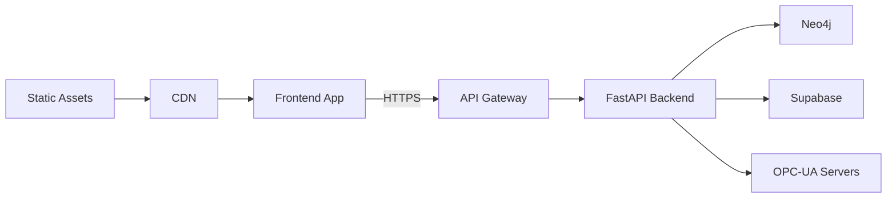

# IGN Scripts: Frontend/Backend Decoupling Plan

## Executive Summary

This document outlines the comprehensive plan for decoupling the IGN Scripts frontend and backend into separate repositories. Following the methodical approach defined in `docs/crawl test/crawl_mcp.py`, this plan ensures a systematic, validated, and production-ready separation of concerns.

**Target Architecture**:
- Backend Repository: `IGN_scripts` (existing, Python-based)
- Frontend Repository: `IGN_scripts_front` (new, React/TypeScript)
- Communication: RESTful API with potential GraphQL extension

## Table of Contents

1. [Current State Analysis](#1-current-state-analysis)
2. [Target Architecture](#2-target-architecture)
3. [Migration Strategy](#3-migration-strategy)
4. [Implementation Phases](#4-implementation-phases)
5. [Risk Management](#5-risk-management)
6. [Success Metrics](#6-success-metrics)
7. [Post-Migration Operations](#7-post-migration-operations)

---

## 1. Current State Analysis

### 1.1 Environment Validation (crawl_mcp.py methodology)

```python
def validate_current_environment() -> dict[str, Any]:
    """Validate current monorepo environment before migration."""
    validation_results = {
        "backend_status": validate_backend_environment(),
        "frontend_status": validate_frontend_environment(),
        "api_readiness": validate_api_layer(),
        "database_connections": validate_database_connections(),
        "dependencies": validate_dependency_separation()
    }
    return validation_results
```

### 1.2 Current Architecture

**Monorepo Structure**:
```
IGN_scripts/
├── src/                    # 132,595 lines of Python (362 files)
│   ├── api/               # FastAPI layer (newly created)
│   ├── core/              # CLI and core functionality
│   ├── ignition/          # Main business logic
│   └── ui/                # Streamlit UI (to be deprecated)
├── frontend/              # React/TypeScript (Phase 12)
│   ├── src/
│   ├── public/
│   └── package.json
├── docs/                  # 40,099 lines (138 files)
├── tests/                 # 8,006 lines (28 files)
└── requirements.txt       # Python dependencies
```

### 1.3 Identified Coupling Points

1. **Direct File System Access**: Frontend currently lives within Python project
2. **Shared Configuration**: Environment variables mixed between frontend/backend
3. **Build Processes**: No clear separation of build pipelines
4. **Development Workflow**: Single repository workflow for different tech stacks
5. **Deployment**: Coupled deployment strategies

### 1.4 Dependency Analysis

**Backend Dependencies**:
- Python 3.12+
- FastAPI, Pydantic
- Neo4j, Supabase
- Industrial libraries (opcua, etc.)

**Frontend Dependencies**:
- React 18, TypeScript
- Vite, Tailwind CSS
- Axios, React Query
- Development tools (ESLint, Prettier)

---

## 2. Target Architecture

### 2.1 Repository Structure

**Backend Repository (IGN_scripts)**:
```
IGN_scripts/
├── src/
│   ├── api/               # FastAPI application
│   │   ├── routers/       # API endpoints
│   │   ├── models/        # Pydantic models
│   │   ├── middleware/    # Auth, CORS, etc.
│   │   └── main.py        # FastAPI app
│   ├── core/              # Business logic
│   ├── ignition/          # Ignition-specific code
│   └── main.py            # CLI entry point
├── tests/
├── docs/
├── docker/
│   ├── Dockerfile
│   └── docker-compose.yml
├── requirements.txt
└── .env.example
```

**Frontend Repository (IGN_scripts_front)**:
```
IGN_scripts_front/
├── src/
│   ├── components/        # Reusable UI components
│   ├── features/          # Feature modules
│   ├── pages/            # Route components
│   ├── lib/              # API clients, utilities
│   │   ├── api/          # API integration
│   │   └── utils/        # Helpers
│   ├── hooks/            # Custom React hooks
│   ├── styles/           # Global styles
│   └── App.tsx           # Root component
├── public/
├── tests/
├── docker/
│   ├── Dockerfile
│   └── nginx.conf
├── package.json
├── vite.config.ts
└── .env.example
```

### 2.2 API Contract Design

**Shared Types Package** (optional):
```
ign-scripts-types/
├── src/
│   ├── api/              # API request/response types
│   ├── domain/           # Domain models
│   └── index.ts          # Exports
├── package.json          # Published to npm
└── tsconfig.json
```

### 2.3 Communication Architecture



---

## 3. Migration Strategy

### 3.1 Progressive Complexity (crawl_mcp.py principle)

Following the crawl_mcp.py methodology of progressive complexity:

```python
# Phase 1: Basic separation (API layer)
def phase1_api_foundation():
    """Create API layer while maintaining monorepo."""
    create_api_endpoints()
    implement_cors_middleware()
    add_authentication()
    validate_api_responses()

# Phase 2: Frontend extraction
def phase2_frontend_extraction():
    """Extract frontend to separate repository."""
    create_new_repository()
    migrate_frontend_code()
    update_api_endpoints()
    test_integration()

# Phase 3: Production deployment
def phase3_production_deployment():
    """Deploy separated architecture."""
    setup_ci_cd_pipelines()
    configure_environments()
    implement_monitoring()
    validate_production()
```

### 3.2 Data Flow Migration

**Current State** (Monorepo):
```
User → Frontend → Direct Python Calls → Database
```

**Target State** (Decoupled):
```
User → Frontend → API Gateway → Backend Services → Database
```

### 3.3 Authentication & Security

1. **JWT-based Authentication**
   ```typescript
   // Frontend auth flow
   const login = async (credentials) => {
     const { token } = await api.auth.login(credentials);
     localStorage.setItem('auth_token', token);
     apiClient.defaults.headers.Authorization = `Bearer ${token}`;
   };
   ```

2. **API Security**
   ```python
   # Backend security middleware
   async def verify_token(token: str = Depends(oauth2_scheme)):
       try:
           payload = jwt.decode(token, SECRET_KEY, algorithms=[ALGORITHM])
           return payload
       except JWTError:
           raise HTTPException(status_code=401)
   ```

---

## 4. Implementation Phases

### Phase 1: API Layer Completion (Week 1-2)

#### 1.1 Expand Current API Implementation
```python
# src/api/routers/__init__.py
from .sme_agent import router as sme_router
from .refactoring import router as refactoring_router
from .scripts import router as scripts_router
from .modules import router as modules_router
from .data_integration import router as data_router
```

#### 1.2 Implement Comprehensive Error Handling
```python
# src/api/middleware/error_handler.py
@app.exception_handler(Exception)
async def global_exception_handler(request: Request, exc: Exception):
    """Global error handler following crawl_mcp.py patterns."""
    error_response = format_error_response(exc)
    return JSONResponse(
        status_code=error_response["status_code"],
        content=error_response["content"]
    )
```

#### 1.3 Add Request Validation
```python
# Using Pydantic for all request/response validation
class ScriptGenerationRequest(BaseModel):
    template_type: str = Field(..., pattern="^[a-z_]+$")
    parameters: dict[str, Any] = Field(...)

    @validator('parameters')
    def validate_parameters(cls, v, values):
        # Comprehensive validation logic
        return v
```

### Phase 2: Frontend Repository Creation (Week 2-3)

#### 2.1 Repository Initialization
```bash
# Create new repository
git init IGN_scripts_front
cd IGN_scripts_front

# Copy frontend files
cp -r ../IGN_scripts/frontend/* .
rm -rf node_modules
npm install

# Initialize git
git add .
git commit -m "Initial commit: Frontend extracted from IGN_scripts"
```

#### 2.2 Update API Integration
```typescript
// src/lib/api/config.ts
export const API_CONFIG = {
  baseURL: process.env.VITE_API_BASE_URL || 'http://localhost:8000',
  timeout: 30000,
  retryAttempts: 3,
  retryDelay: 1000
};

// src/lib/api/client.ts
const apiClient = createApiClient(API_CONFIG);
```

#### 2.3 Environment Configuration
```bash
# .env.development
VITE_API_BASE_URL=http://localhost:8000/api
VITE_APP_NAME=IGN Scripts
VITE_APP_VERSION=0.1.0

# .env.production
VITE_API_BASE_URL=https://api.ign-scripts.com/api
VITE_APP_NAME=IGN Scripts
VITE_APP_VERSION=0.1.0
```

### Phase 3: Testing & Validation (Week 3-4)

#### 3.1 Integration Testing
```typescript
// tests/integration/api.test.ts
describe('API Integration', () => {
  it('should connect to backend API', async () => {
    const response = await apiClient.get('/health');
    expect(response.data.status).toBe('healthy');
  });

  it('should handle authentication', async () => {
    const token = await authenticate(testCredentials);
    expect(token).toBeDefined();
  });
});
```

#### 3.2 End-to-End Testing
```typescript
// e2e/script-generation.spec.ts
test('Script Generation Flow', async ({ page }) => {
  await page.goto('/scripts/generate');
  await page.selectOption('#template', 'opcua_client');
  await page.fill('#server-url', 'opc.tcp://localhost:4840');
  await page.click('#generate-button');
  await expect(page.locator('#generated-script')).toBeVisible();
});
```

### Phase 4: CI/CD Pipeline Setup (Week 4-5)

#### 4.1 Backend CI/CD
```yaml
# .github/workflows/backend.yml
name: Backend CI/CD
on:
  push:
    branches: [main, develop]
  pull_request:
    branches: [main]

jobs:
  test:
    runs-on: ubuntu-latest
    services:
      neo4j:
        image: neo4j:5
        env:
          NEO4J_AUTH: neo4j/password
    steps:
      - uses: actions/checkout@v3
      - name: Set up Python
        uses: actions/setup-python@v4
        with:
          python-version: '3.12'
      - name: Install dependencies
        run: |
          pip install -r requirements.txt
          pip install -r requirements-dev.txt
      - name: Run tests
        run: pytest tests/ --cov=src --cov-report=xml
      - name: Upload coverage
        uses: codecov/codecov-action@v3
```

#### 4.2 Frontend CI/CD
```yaml
# .github/workflows/frontend.yml
name: Frontend CI/CD
on:
  push:
    branches: [main, develop]
  pull_request:
    branches: [main]

jobs:
  test:
    runs-on: ubuntu-latest
    steps:
      - uses: actions/checkout@v3
      - name: Setup Node.js
        uses: actions/setup-node@v3
        with:
          node-version: '18'
          cache: 'npm'
      - name: Install dependencies
        run: npm ci
      - name: Lint
        run: npm run lint
      - name: Type check
        run: npm run type-check
      - name: Test
        run: npm run test
      - name: Build
        run: npm run build
```

### Phase 5: Deployment Strategy (Week 5-6)

#### 5.1 Backend Deployment
```dockerfile
# docker/backend/Dockerfile
FROM python:3.12-slim

WORKDIR /app

# Install system dependencies
RUN apt-get update && apt-get install -y \
    gcc \
    && rm -rf /var/lib/apt/lists/*

# Install Python dependencies
COPY requirements.txt .
RUN pip install --no-cache-dir -r requirements.txt

# Copy application code
COPY src/ ./src/
COPY .env.example .env

# Run the application
EXPOSE 8000
CMD ["uvicorn", "src.api.main:app", "--host", "0.0.0.0", "--port", "8000"]
```

#### 5.2 Frontend Deployment
```dockerfile
# docker/frontend/Dockerfile
FROM node:18-alpine AS builder

WORKDIR /app

# Copy package files
COPY package*.json ./
RUN npm ci

# Copy source code
COPY . .

# Build the application
RUN npm run build

# Production stage
FROM nginx:alpine

# Copy built files
COPY --from=builder /app/dist /usr/share/nginx/html

# Copy nginx configuration
COPY docker/nginx.conf /etc/nginx/nginx.conf

EXPOSE 80
CMD ["nginx", "-g", "daemon off;"]
```

#### 5.3 Docker Compose for Development
```yaml
# docker-compose.dev.yml
version: '3.8'

services:
  backend:
    build:
      context: ./IGN_scripts
      dockerfile: docker/backend/Dockerfile
    ports:
      - "8000:8000"
    environment:
      - NEO4J_URI=bolt://neo4j:7687
      - SUPABASE_URL=http://supabase:8000
    volumes:
      - ./IGN_scripts/src:/app/src
    depends_on:
      - neo4j
      - supabase

  frontend:
    build:
      context: ./IGN_scripts_front
      dockerfile: docker/frontend/Dockerfile.dev
    ports:
      - "3000:3000"
    environment:
      - VITE_API_BASE_URL=http://backend:8000/api
    volumes:
      - ./IGN_scripts_front/src:/app/src

  neo4j:
    image: neo4j:5
    ports:
      - "7474:7474"
      - "7687:7687"
    environment:
      - NEO4J_AUTH=neo4j/password
    volumes:
      - neo4j_data:/data

  supabase:
    # Supabase services configuration
    # ... (existing configuration)

volumes:
  neo4j_data:
  supabase_data:
```

### Phase 6: Production Infrastructure (Week 6-7)

#### 6.1 Kubernetes Deployment
```yaml
# k8s/backend-deployment.yaml
apiVersion: apps/v1
kind: Deployment
metadata:
  name: ign-scripts-backend
spec:
  replicas: 3
  selector:
    matchLabels:
      app: ign-scripts-backend
  template:
    metadata:
      labels:
        app: ign-scripts-backend
    spec:
      containers:
      - name: backend
        image: ign-scripts/backend:latest
        ports:
        - containerPort: 8000
        env:
        - name: DATABASE_URL
          valueFrom:
            secretKeyRef:
              name: ign-secrets
              key: database-url
        resources:
          requests:
            memory: "512Mi"
            cpu: "500m"
          limits:
            memory: "1Gi"
            cpu: "1000m"
```

#### 6.2 API Gateway Configuration
```yaml
# k8s/api-gateway.yaml
apiVersion: networking.k8s.io/v1
kind: Ingress
metadata:
  name: ign-scripts-ingress
  annotations:
    kubernetes.io/ingress.class: nginx
    cert-manager.io/cluster-issuer: letsencrypt-prod
spec:
  tls:
  - hosts:
    - api.ign-scripts.com
    - app.ign-scripts.com
    secretName: ign-scripts-tls
  rules:
  - host: api.ign-scripts.com
    http:
      paths:
      - path: /
        pathType: Prefix
        backend:
          service:
            name: ign-scripts-backend
            port:
              number: 8000
  - host: app.ign-scripts.com
    http:
      paths:
      - path: /
        pathType: Prefix
        backend:
          service:
            name: ign-scripts-frontend
            port:
              number: 80
```

---

## 5. Risk Management

### 5.1 Technical Risks

| Risk | Impact | Mitigation Strategy |
|------|--------|-------------------|
| API Performance Degradation | High | Implement caching, optimize queries, use connection pooling |
| Authentication Issues | High | Comprehensive testing, fallback auth methods |
| Data Consistency | Medium | Transaction management, eventual consistency patterns |
| Network Latency | Medium | CDN for frontend, regional deployments |
| Version Mismatch | Low | API versioning, backward compatibility |

### 5.2 Operational Risks

| Risk | Impact | Mitigation Strategy |
|------|--------|-------------------|
| Deployment Failures | High | Blue-green deployments, automated rollback |
| Monitoring Gaps | Medium | Comprehensive observability stack |
| Security Vulnerabilities | High | Regular security audits, dependency scanning |
| Team Knowledge Gap | Medium | Documentation, training sessions |

### 5.3 Rollback Strategy

```python
# Rollback procedure
def rollback_deployment():
    """Emergency rollback to monorepo."""
    steps = [
        "1. Switch DNS to previous monorepo deployment",
        "2. Restore database to pre-migration snapshot",
        "3. Notify users of temporary rollback",
        "4. Analyze failure and adjust plan",
        "5. Re-attempt migration with fixes"
    ]
    return steps
```

---

## 6. Success Metrics

### 6.1 Technical Metrics

| Metric | Target | Measurement Method |
|--------|--------|-------------------|
| API Response Time | < 200ms (p95) | APM monitoring |
| Frontend Build Time | < 2 minutes | CI/CD metrics |
| Deployment Success Rate | > 95% | Deployment pipeline |
| Test Coverage | > 80% | Coverage reports |
| API Availability | 99.9% | Uptime monitoring |

### 6.2 Development Metrics

| Metric | Target | Measurement Method |
|--------|--------|-------------------|
| PR Merge Time | < 24 hours | GitHub Analytics |
| Build Frequency | > 10/day | CI/CD metrics |
| Deployment Frequency | > 5/week | Deployment logs |
| Rollback Rate | < 5% | Deployment metrics |

### 6.3 Business Metrics

| Metric | Target | Measurement Method |
|--------|--------|-------------------|
| User Response Time | < 1s | Real user monitoring |
| Error Rate | < 0.1% | Error tracking |
| User Satisfaction | > 4.5/5 | User surveys |
| Feature Velocity | +20% | Sprint metrics |

---

## 7. Post-Migration Operations

### 7.1 Monitoring Stack

```yaml
# Monitoring architecture
monitoring:
  metrics:
    - prometheus
    - grafana
  logs:
    - elasticsearch
    - logstash
    - kibana
  traces:
    - jaeger
  alerts:
    - alertmanager
    - pagerduty
```

### 7.2 Maintenance Procedures

#### Backend Maintenance
```python
# Regular maintenance tasks
maintenance_tasks = {
    "daily": [
        "Check API health endpoints",
        "Review error logs",
        "Monitor database performance"
    ],
    "weekly": [
        "Update dependencies",
        "Review security alerts",
        "Optimize slow queries"
    ],
    "monthly": [
        "Security audit",
        "Performance review",
        "Capacity planning"
    ]
}
```

#### Frontend Maintenance
```typescript
// Maintenance checklist
const maintenanceTasks = {
  daily: [
    'Check build status',
    'Review error tracking',
    'Monitor bundle size'
  ],
  weekly: [
    'Update dependencies',
    'Run accessibility audit',
    'Review performance metrics'
  ],
  monthly: [
    'Security dependency scan',
    'Bundle optimization',
    'Browser compatibility check'
  ]
};
```

### 7.3 Documentation Updates

1. **API Documentation**
   - OpenAPI/Swagger specification
   - Postman collections
   - Integration guides

2. **Frontend Documentation**
   - Component library (Storybook)
   - Architecture decisions
   - Development guides

3. **Operations Documentation**
   - Deployment procedures
   - Troubleshooting guides
   - Incident response playbooks

---

## Appendix A: Command Reference

### Backend Commands
```bash
# Development
uvicorn src.api.main:app --reload --port 8000

# Testing
pytest tests/ --cov=src --cov-report=html

# Linting
ruff check src/ --fix

# Type checking
mypy src/
```

### Frontend Commands
```bash
# Development
npm run dev

# Testing
npm run test
npm run test:e2e

# Building
npm run build

# Linting
npm run lint
npm run lint:fix
```

### Deployment Commands
```bash
# Backend deployment
docker build -t ign-scripts-backend:latest .
docker push ign-scripts-backend:latest
kubectl apply -f k8s/backend/

# Frontend deployment
docker build -t ign-scripts-frontend:latest .
docker push ign-scripts-frontend:latest
kubectl apply -f k8s/frontend/
```

---

## Appendix B: Migration Checklist

### Pre-Migration Checklist
- [ ] Complete API implementation
- [ ] Test all API endpoints
- [ ] Update frontend to use API
- [ ] Create deployment pipelines
- [ ] Document all procedures
- [ ] Train team members
- [ ] Create rollback plan

### Migration Day Checklist
- [ ] Backup all data
- [ ] Notify stakeholders
- [ ] Execute migration scripts
- [ ] Validate API connectivity
- [ ] Test critical paths
- [ ] Monitor performance
- [ ] Document issues

### Post-Migration Checklist
- [ ] Verify all functionality
- [ ] Check performance metrics
- [ ] Review error logs
- [ ] Update documentation
- [ ] Gather team feedback
- [ ] Plan improvements
- [ ] Celebrate success! 🎉

---

## Conclusion

This decoupling plan provides a comprehensive, methodical approach to separating the IGN Scripts frontend and backend. By following the crawl_mcp.py methodology of progressive complexity, comprehensive validation, and robust error handling, we ensure a smooth transition to a more scalable, maintainable architecture.

The benefits of this separation include:
- **Independent scaling** of frontend and backend
- **Technology flexibility** for each layer
- **Improved developer experience** with focused repositories
- **Better security boundaries** and access control
- **Faster deployment cycles** for each component

With careful execution and monitoring, this migration will position IGN Scripts for continued growth and success in serving industrial automation needs.

---

## Appendix C: CLI to API Endpoint Mapping

### Comprehensive CLI Command to REST API Mapping

This section provides a complete mapping of all CLI commands to their corresponding REST API endpoints, ensuring the frontend can fully replicate CLI functionality.

#### Script Generation Commands
| CLI Command | API Endpoint | HTTP Method | Request Body |
|-------------|--------------|-------------|--------------|
| `ign script generate <type>` | `/api/v1/scripts/generate` | POST | `{template_type, parameters}` |
| `ign script list` | `/api/v1/scripts` | GET | - |
| `ign script analyze <file>` | `/api/v1/scripts/analyze` | POST | `{file_path}` |
| `ign script validate <file>` | `/api/v1/scripts/validate` | POST | `{script_content}` |

#### Template Management Commands
| CLI Command | API Endpoint | HTTP Method | Request Body |
|-------------|--------------|-------------|--------------|
| `ign template list` | `/api/v1/templates` | GET | - |
| `ign template get <name>` | `/api/v1/templates/{name}` | GET | - |
| `ign template create` | `/api/v1/templates` | POST | `{name, content, parameters}` |
| `ign template update <name>` | `/api/v1/templates/{name}` | PUT | `{content, parameters}` |
| `ign template delete <name>` | `/api/v1/templates/{name}` | DELETE | - |

#### Module Management Commands
| CLI Command | API Endpoint | HTTP Method | Request Body |
|-------------|--------------|-------------|--------------|
| `ign module create <name>` | `/api/v1/modules` | POST | `{name, type, config}` |
| `ign module list` | `/api/v1/modules` | GET | - |
| `ign module package <name>` | `/api/v1/modules/{name}/package` | POST | - |
| `ign module deploy <name>` | `/api/v1/modules/{name}/deploy` | POST | `{target_gateway}` |
| `ign module status <name>` | `/api/v1/modules/{name}/status` | GET | - |

#### SME Agent Commands
| CLI Command | API Endpoint | HTTP Method | Request Body |
|-------------|--------------|-------------|--------------|
| `ign module sme validate-env` | `/api/v1/sme/validate-env` | GET | - |
| `ign module sme status` | `/api/v1/sme/status` | GET | - |
| `ign module sme ask "<question>"` | `/api/v1/sme/ask` | POST | `{question, context}` |
| `ign module sme analyze <system>` | `/api/v1/sme/analyze` | POST | `{system_type, parameters}` |
| `ign module sme tune <loop>` | `/api/v1/sme/tune` | POST | `{loop_id, tuning_params}` |

#### Refactoring Commands
| CLI Command | API Endpoint | HTTP Method | Request Body |
|-------------|--------------|-------------|--------------|
| `refactor detect` | `/api/v1/refactor/detect` | GET | - |
| `refactor analyze <file>` | `/api/v1/refactor/analyze` | POST | `{file_path}` |
| `refactor split <file>` | `/api/v1/refactor/split` | POST | `{file_path, strategy}` |
| `refactor statistics` | `/api/v1/refactor/statistics` | GET | - |
| `refactor validate <file>` | `/api/v1/refactor/validate` | POST | `{file_path}` |

#### Data Integration Commands
| CLI Command | API Endpoint | HTTP Method | Request Body |
|-------------|--------------|-------------|--------------|
| `ign data connect <type>` | `/api/v1/data/connections` | POST | `{type, config}` |
| `ign data test <connection>` | `/api/v1/data/connections/{id}/test` | POST | - |
| `ign data query <connection>` | `/api/v1/data/query` | POST | `{connection_id, query}` |
| `ign data dataset buildout` | `/api/v1/data/datasets/buildout` | POST | `{dataset_config}` |
| `ign data export <dataset>` | `/api/v1/data/datasets/{id}/export` | POST | `{format, filters}` |

#### Gateway Management Commands
| CLI Command | API Endpoint | HTTP Method | Request Body |
|-------------|--------------|-------------|--------------|
| `ign gateway list` | `/api/v1/gateways` | GET | - |
| `ign gateway connect <url>` | `/api/v1/gateways/connect` | POST | `{url, credentials}` |
| `ign gateway health <id>` | `/api/v1/gateways/{id}/health` | GET | - |
| `ign gateway browse <id>` | `/api/v1/gateways/{id}/browse` | GET | - |
| `ign gateway export <id>` | `/api/v1/gateways/{id}/export` | POST | `{export_options}` |

#### OPC-UA Commands
| CLI Command | API Endpoint | HTTP Method | Request Body |
|-------------|--------------|-------------|--------------|
| `ign opcua browse <server>` | `/api/v1/opcua/browse` | POST | `{server_url, node_id}` |
| `ign opcua read <server> <node>` | `/api/v1/opcua/read` | POST | `{server_url, node_ids}` |
| `ign opcua subscribe <server>` | `/api/v1/opcua/subscribe` | POST | `{server_url, node_ids, interval}` |
| `ign opcua discover` | `/api/v1/opcua/discover` | GET | - |

#### Backup Management Commands
| CLI Command | API Endpoint | HTTP Method | Request Body |
|-------------|--------------|-------------|--------------|
| `ign backup create` | `/api/v1/backups` | POST | `{backup_type, targets}` |
| `ign backup list` | `/api/v1/backups` | GET | - |
| `ign backup restore <id>` | `/api/v1/backups/{id}/restore` | POST | `{restore_options}` |
| `ign backup validate <id>` | `/api/v1/backups/{id}/validate` | POST | - |
| `ign backup schedule` | `/api/v1/backups/schedule` | POST | `{schedule_config}` |

#### Code Intelligence Commands
| CLI Command | API Endpoint | HTTP Method | Request Body |
|-------------|--------------|-------------|--------------|
| `ign code analytics health` | `/api/v1/code/analytics/health` | GET | - |
| `ign code ai context <file>` | `/api/v1/code/ai/context` | POST | `{file_path}` |
| `ign code validate <script>` | `/api/v1/code/validate` | POST | `{script_content}` |
| `ign code check-hallucinations` | `/api/v1/code/hallucinations` | POST | `{script_content}` |
| `ign code find-examples <pattern>` | `/api/v1/code/examples` | POST | `{pattern, language}` |

#### Web Intelligence Commands
| CLI Command | API Endpoint | HTTP Method | Request Body |
|-------------|--------------|-------------|--------------|
| `ign web crawl <url>` | `/api/v1/web/crawl` | POST | `{url, depth, patterns}` |
| `ign web search <query>` | `/api/v1/web/search` | POST | `{query, filters}` |
| `ign web update` | `/api/v1/web/update` | POST | - |
| `ign web sources` | `/api/v1/web/sources` | GET | - |
| `ign web status` | `/api/v1/web/status` | GET | - |

#### Learning System Commands
| CLI Command | API Endpoint | HTTP Method | Request Body |
|-------------|--------------|-------------|--------------|
| `ign learning analyze` | `/api/v1/learning/analyze` | GET | - |
| `ign learning patterns` | `/api/v1/learning/patterns` | GET | - |
| `ign learning recommend` | `/api/v1/learning/recommend` | POST | `{context, user_id}` |
| `ign learning train` | `/api/v1/learning/train` | POST | `{training_data}` |

### API Response Standardization

All API endpoints follow a consistent response format:

```typescript
interface APIResponse<T> {
  success: boolean;
  data?: T;
  error?: {
    code: string;
    message: string;
    details?: any;
  };
  metadata?: {
    timestamp: string;
    request_id: string;
    execution_time: number;
  };
}
```

### WebSocket Endpoints for Real-time Features

| Feature | WebSocket Endpoint | Message Types |
|---------|-------------------|---------------|
| Log Streaming | `/ws/logs` | `subscribe`, `unsubscribe`, `log_entry` |
| Progress Tracking | `/ws/progress` | `task_start`, `task_progress`, `task_complete` |
| OPC-UA Monitoring | `/ws/opcua` | `subscribe_tags`, `tag_update`, `alarm_event` |
| System Health | `/ws/health` | `health_check`, `status_update`, `alert` |

---

## Appendix D: Neo4j Context Sharing Mechanism

### Overview

To maintain AI coding agent effectiveness across both frontend and backend repositories, we implement a shared Neo4j knowledge graph accessible from both environments. This ensures the AI agent has deep understanding of backend functionality while developing the frontend.

### 1. Shared Neo4j Configuration

#### Environment Variables (Both Repos)
```bash
# .env.shared
NEO4J_URI=bolt://neo4j.ign-scripts.com:7687
NEO4J_USER=readonly_agent
NEO4J_PASSWORD=<secure_password>
NEO4J_DATABASE=ign_knowledge
```

#### Read-Only Access for Frontend Development
```cypher
-- Create read-only user for frontend development
CREATE USER readonly_agent SET PASSWORD '<secure_password>' CHANGE NOT REQUIRED;
GRANT ROLE reader TO readonly_agent;
GRANT ACCESS ON DATABASE ign_knowledge TO readonly_agent;
```

### 2. Knowledge Graph API Service

Create a dedicated API service for knowledge graph queries:

```python
# src/api/routers/knowledge.py
from fastapi import APIRouter, Depends
from neo4j import GraphDatabase
from typing import List, Dict, Any

router = APIRouter(prefix="/api/v1/knowledge", tags=["knowledge"])

class KnowledgeGraphService:
    def __init__(self):
        self.driver = GraphDatabase.driver(
            os.getenv("NEO4J_URI"),
            auth=(os.getenv("NEO4J_USER"), os.getenv("NEO4J_PASSWORD"))
        )

    async def query_context(self, query: str) -> List[Dict[str, Any]]:
        """Execute read-only queries against knowledge graph."""
        with self.driver.session() as session:
            result = session.run(query)
            return [record.data() for record in result]

    async def get_cli_implementation(self, command: str) -> Dict[str, Any]:
        """Get implementation details for a CLI command."""
        query = """
        MATCH (cmd:CLICommand {name: $command})
        OPTIONAL MATCH (cmd)-[:IMPLEMENTS]->(func:Function)
        OPTIONAL MATCH (cmd)-[:USES]->(module:Module)
        RETURN cmd, collect(func) as functions, collect(module) as modules
        """
        # ... implementation

    async def get_api_mapping(self, cli_command: str) -> Dict[str, Any]:
        """Get API endpoint mapping for CLI command."""
        query = """
        MATCH (cmd:CLICommand {name: $cli_command})-[:MAPS_TO]->(api:APIEndpoint)
        RETURN api.path as endpoint, api.method as method, api.schema as schema
        """
        # ... implementation

@router.get("/cli/{command}")
async def get_cli_context(command: str, kg: KnowledgeGraphService = Depends()):
    """Get comprehensive context for a CLI command."""
    return await kg.get_cli_implementation(command)

@router.get("/api-mapping/{cli_command}")
async def get_api_mapping(cli_command: str, kg: KnowledgeGraphService = Depends()):
    """Get API endpoint mapping for CLI command."""
    return await kg.get_api_mapping(cli_command)

@router.post("/query")
async def query_knowledge_graph(query: Dict[str, str], kg: KnowledgeGraphService = Depends()):
    """Execute custom read-only queries."""
    return await kg.query_context(query["cypher"])
```

### 3. Frontend Knowledge Integration

#### TypeScript Client for Knowledge Graph
```typescript
// frontend/src/lib/knowledge/client.ts
import { apiClient } from '../api/client';

export interface CLIContext {
  command: string;
  implementation: {
    functions: string[];
    modules: string[];
    parameters: Record<string, any>;
  };
  examples: string[];
}

export interface APIMapping {
  endpoint: string;
  method: string;
  schema: Record<string, any>;
}

export class KnowledgeGraphClient {
  async getCLIContext(command: string): Promise<CLIContext> {
    const response = await apiClient.get(`/knowledge/cli/${command}`);
    return response.data;
  }

  async getAPIMapping(cliCommand: string): Promise<APIMapping> {
    const response = await apiClient.get(`/knowledge/api-mapping/${cliCommand}`);
    return response.data;
  }

  async query(cypher: string): Promise<any[]> {
    const response = await apiClient.post('/knowledge/query', { cypher });
    return response.data;
  }
}

// Singleton instance
export const knowledgeGraph = new KnowledgeGraphClient();
```

### 4. AI Agent Context Files

#### Backend Context File (.agent_context.json)
```json
{
  "repository": "IGN_scripts",
  "type": "backend",
  "neo4j_access": "read-write",
  "knowledge_graph": {
    "nodes": 10389,
    "relationships": 15234,
    "last_updated": "2025-01-10T08:00:00Z"
  },
  "api_endpoints": {
    "count": 127,
    "base_url": "http://localhost:8000/api/v1"
  }
}
```

#### Frontend Context File (.agent_context.json)
```json
{
  "repository": "IGN_scripts_front",
  "type": "frontend",
  "neo4j_access": "read-only",
  "backend_api": "http://localhost:8000/api/v1",
  "knowledge_api": "http://localhost:8000/api/v1/knowledge",
  "ui_components": {
    "pages": [],
    "components": [],
    "hooks": []
  }
}
```

### 5. Cursor IDE Configuration

#### Shared Workspace Configuration
```json
// .cursor/settings.json (both repos)
{
  "ai.context.sources": [
    {
      "type": "neo4j",
      "uri": "${env:NEO4J_URI}",
      "database": "ign_knowledge",
      "readonly": true
    },
    {
      "type": "api",
      "endpoint": "http://localhost:8000/api/v1/knowledge"
    }
  ],
  "ai.context.autoLoad": [
    ".agent_context.json",
    "docs/AGENT_KNOWLEDGE_SYSTEM.md"
  ]
}
```

### 6. Development Workflow with Shared Context

#### 1. Frontend Developer Workflow
```bash
# Start backend API (for knowledge access)
cd ../IGN_scripts
docker-compose up neo4j api

# Work on frontend with full context
cd ../IGN_scripts_front
npm run dev

# AI agent has access to:
# - Backend implementation details via Neo4j
# - API endpoint mappings
# - Real-time backend changes
```

#### 2. Context Synchronization
```python
# scripts/sync_knowledge.py
"""Sync knowledge graph updates between repos."""
import subprocess
from neo4j import GraphDatabase

def sync_api_mappings():
    """Update API endpoint mappings in knowledge graph."""
    # Extract API routes from FastAPI
    # Update Neo4j with latest mappings
    # Generate TypeScript types for frontend
    pass

def generate_frontend_types():
    """Generate TypeScript types from backend models."""
    # Use pydantic2ts or similar
    # Output to frontend/src/types/api/
    pass

if __name__ == "__main__":
    sync_api_mappings()
    generate_frontend_types()
```

### 7. Benefits of Shared Context

1. **Consistent Understanding**: AI agent understands backend implementation when building frontend
2. **Accurate API Integration**: Direct mapping from CLI commands to API endpoints
3. **Type Safety**: Generated types ensure frontend/backend compatibility
4. **Real-time Updates**: Changes in backend are immediately reflected
5. **Reduced Hallucinations**: AI has access to actual implementation details

### 8. Security Considerations

1. **Read-Only Access**: Frontend only has read access to knowledge graph
2. **API Gateway**: All modifications go through authenticated API
3. **Secrets Management**: Use environment variables, never commit credentials
4. **Network Isolation**: Production Neo4j not directly accessible from frontend
5. **Audit Logging**: Track all knowledge graph queries for security

This shared context mechanism ensures that AI coding agents maintain deep understanding of the system architecture regardless of which repository they're working in, enabling efficient and accurate development across both frontend and backend.
